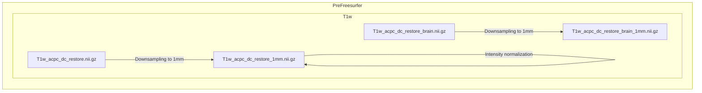
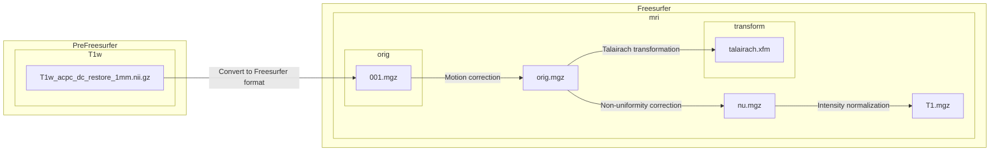

# Olfactory Dysfunction in Clinical High-Risk for Psychosis: Structural Connectivity
*Olfactory_Dysfunction_in_CHR* repository is developed by Jun Seo Hwang.
-   Jun Seo Hwang,  [junseo97@snu.ac.kr](mailto:junseo97@snu.ac.kr)

## Prerequisite
- FSL
- Freesurfer(ver 5.3.0)
- Pipeline-master
- workbench
- raw data directory

## Raw Data Structure

```
── working directory
   ├── subject_01
   │   ├── DTI_B1000
   │   │   ├── DTI_B1000.nii.gz
   │   │   ├── DTI_B1000.bval
   │   │   └── DTI_B1000.bvec
   │   ├── DTI_B2000
   │   │   ├── DTI_B2000.nii.gz
   │   │   ├── DTI_B2000.bval
   │   │   └── DTI_B2000.bvec
   │   ├── DTI_B3000
   │   │   ├── DTI_B3000.nii.gz
   │   │   ├── DTI_B3000.bval
   │   │   └── DTI_B3000.bvec
   │   ├── DTI_BLIP_LR
   │   │   ├── DTI_BLIP_LR.nii.gz
   │   │   ├── DTI_BLIP_LR.bval
   │   │   └── DTI_BLIP_LR.bvec
   │   ├── DTI_BLIP_RL
   │   │   ├── DTI_BLIP_RL.nii.gz
   │   │   ├── DTI_BLIP_RL.bval
   │   │   └── DTI_BLIP_RL.bvec 
   │   ├── T1
   │   │   └── T1.nii.gz 
   │   └── T2
   │       └── T2.nii.gz
   ├── subject_02
   │       :    
   ├── subject_n
   │
   ├── Pipelines-master
   │
   └── workbench
```


## PreFreesurfer


## Freesurfer
The main goals of this pipeline are to segment the volume into predefined structures (including the subcortical parcels used in CIFTI), reconstruct white and pial cortical surfaces, and perform FreeSurfer’s standard folding-based surface registration to their surface atlas (fsaverage).

### 1. Downsample to 1mm
The limitation with recon-all is that it cannot handle images of higher than 1 mm isotropic resolution or structural scans of greater than 256 × 256 × 256 voxels. The structural scans which exceed these limits must therefore be downsampled to 1 mm with spline interpolation before launching recon-all.

- Perform downsampling of the ACPC-aligned bias field corrected T1w image, **T1w_acpc_dc_restore.nii.gz**  to 1mm isotropic voxel size using `flirt` with spline interpolation. The output is saved as **T1w_acpc_dc_restore_1mm.nii.gz**.
- Apply a warp (spline interpolation) to the T1w image, **T1w_acpc_dc_restore.nii.gz**  and a warp (nearest-neighbor interpolation) to the T1w brain image **T1w_acpc_dc_restore_brain.nii.gz** to match the downsampled space. The output is saved as **T1w_acpc_dc_restore_1mm.nii.gz** and **T1w_acpc_dc_restore_brain_1mm.nii.gz**.
- Adjust the intensity of the downsampled T1w image by dividing the mean intensity, multiplying by 150 and taking the absolute value. The result is saved as **T1w_acpc_dc_restore_1mm.nii.gz**.

Terminal output:
```
Subject FREESURFER : Making Spline Interpolated Downsample to 1mm
```


### 2. 1st (out of 4) recon-all stage
FreeSurfer's autorecon1 pipeline is invoked, which includes process steps 1-5 of Autorecon Processing Stages.
1.  Motion Correction and Conform
2.  NU (Non-Uniform intensity normalization)
3.  Talairach transform computation
4.  Intensity Normalization 1
5. ~~Skull Strip~~

The skullstrip option is excluded due to reliability issues of poor FreeSurfer mri_em_register registrations with skull on.

- Convert T1w image in NIfTI format **T1w_acpc_dc_restore_1mm.nii.gz** to the FreeSurfer-specific MGZ format **001.mgz**.
- No motion correction is performed for **001.mgz** since there is only one image. Instead, **001.mgz** is copied to **orig.mgz**
	> No motion correction is done when there are multiple source volumes. This step will correct for small motions between them and then average them together.
	
- Perform Talairach transformation from **orig.mgz** to the MNI305 atlas using `talairach_avi`. The output affine transformation file is saved as **talairach.xfm**
- Perform non-uniform intensity correction on **orig.mgz** using `nu_correct`. Four iterations of nu_correct are run. The result is saved as **nu.mgz**
- Perform intensity normalization on **nu.mgz** using `mri_normalize`. The normalization is done to achieve a mean intensity of 110 in the white matter. The output is saved as **T1.mgz**.

Terminal output:
```
Subject FREESURFER : Running autorecon1 steps with the exception of -skullstrip
		.
		.
		.
#--------------------------------------------
#@# MotionCor
		.
		.
		.
#--------------------------------------------
#@# Talairach
		.
		.
		.
#--------------------------------------------
#@# Nu Intensity Correction
		.
		.
		.
#--------------------------------------------
#@# Intensity Normalization
		.
		.
		.
#------------------------------------------

Started at 
Ended   at 
#@#%# recon-all-run-time-hours 
recon-all -s Subject finished without error

```


