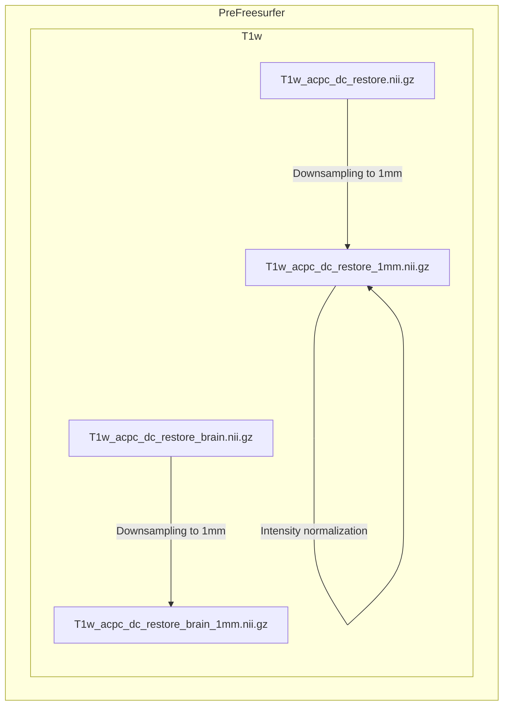
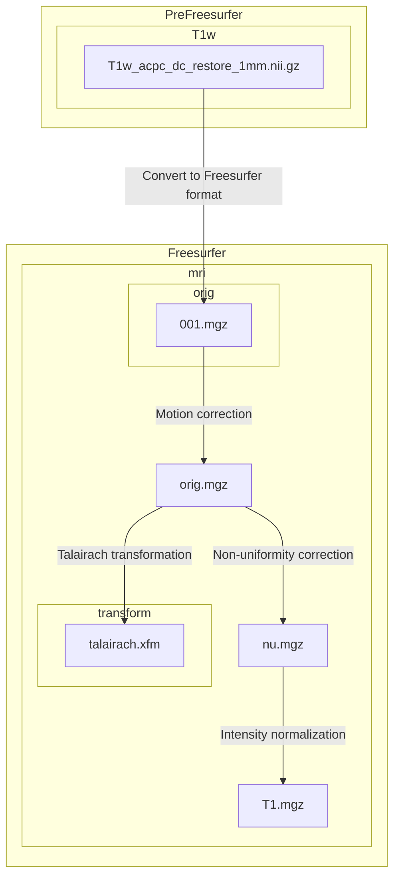
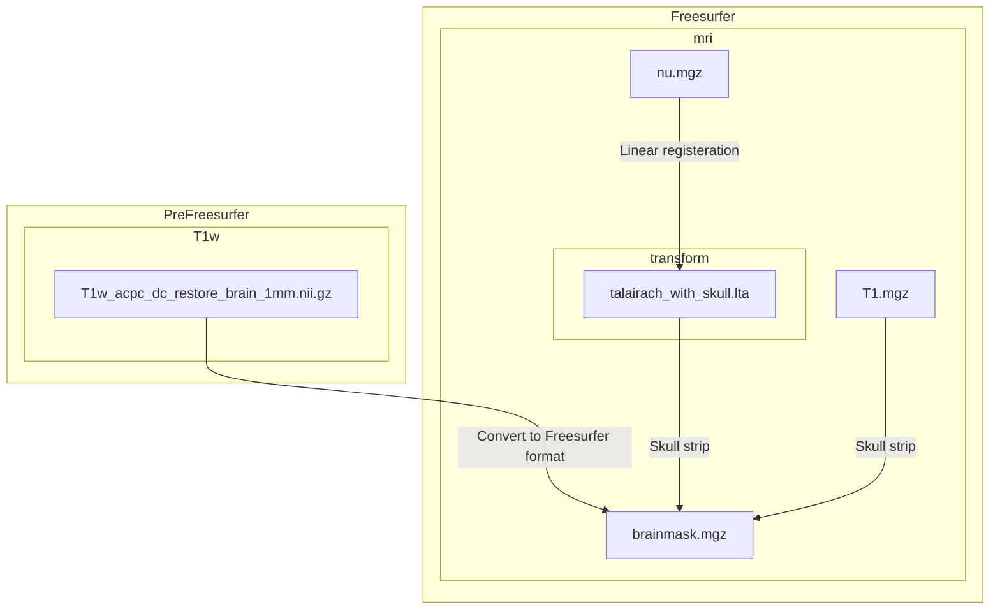
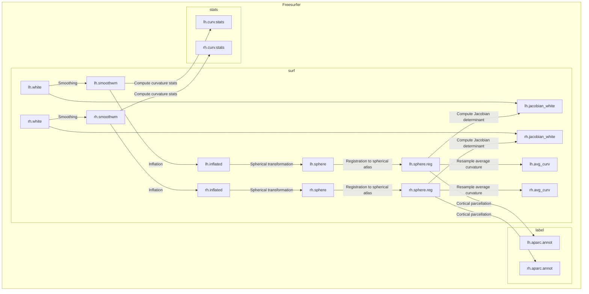

```mermaid
flowchart TD
    subgraph Freesurfer
        subgraph mri
	        brainmask.mgz
	        subgraph transform
		        talairach.lta
		        talairach.m3z
		        talairach_with_skull_2.lta
	        end
	        nu.mgz
	        nu.mgz ---> |Intensity normalization|norm.mgz
	        nu.mgz ---> |Remove neck|nu_noneck.mgz
	        norm.mgz ---> |Label subcortical structures|aseg.mgz
	        aseg.mgz ---> |Intensity normalization|brain.mgz
	        brain.mgz ---> |White matter segmentation|wm.mgz
	        wm.mgz ---> |Fill|filled.mgz 
	    end
	    subgraph surf
		    lh.orig.nofix ---> |Smoothing|lh.smoothwm
		    rh.orig.nofix ---> |Smoothing|rh.smoothwm
		    lh.smoothwm ---> |Inflation|lh.inflated.nofix
		    rh.smoothwm ---> |Inflation|rh.inflated.nofix
		    lh.inflated.nofix ---> |QSphere transformation|lh.qsphere.nofix
		    rh.inflated.nofix ---> |QSphere transformation|rh.qsphere.nofix
		    lh.qsphere.nofix ---> |Fix topology|lh.orig
		    rh.qsphere.nofix ---> |Fix topology|rh.orig
		    lh.orig ---> |Create final white surface|lh.white
		    lh.orig ---> |Create final pial surface|lh.pial
		    rh.orig ---> |Create final white surface|rh.white
		    rh.orig ---> |Create final pial surface|rh.pial
		    
	    end
    end
    nu.mgz ---> |Linear registration|talairach.lta
    brainmask.mgz ---> |Linear registration|talairach.lta
    norm.mgz ---> |Non-linear registration|talairach.m3z
    talairach.m3z ---> nu_noneck.mgz
    nu_noneck.mgz ---> |Linear registration|talairach_with_skull_2.lta
    talairach.lta ---> talairach_with_skull_2.lta
    filled.mgz ---> |Tessellate|lh.orig.nofix
	filled.mgz ---> |Tessellate|rh.orig.nofix
    filled.mgz ---> lh.white
	filled.mgz ---> lh.pial
	filled.mgz ---> rh.white
    filled.mgz ---> rh.pial
```

# Olfactory Dysfunction in Clinical High-Risk for Psychosis: Structural Connectivity
*Olfactory_Dysfunction_in_CHR* repository is developed by Jun Seo Hwang.
-   Jun Seo Hwang,  [junseo97@snu.ac.kr](mailto:junseo97@snu.ac.kr)

## Prerequisite
- FSL
- Freesurfer(ver 5.3.0)
- Pipeline-master
- workbench
- raw data directory

## Raw Data Structure

```
── working directory
   ├── subject_01
   │   ├── DTI_B1000
   │   │   ├── DTI_B1000.nii.gz
   │   │   ├── DTI_B1000.bval
   │   │   └── DTI_B1000.bvec
   │   ├── DTI_B2000
   │   │   ├── DTI_B2000.nii.gz
   │   │   ├── DTI_B2000.bval
   │   │   └── DTI_B2000.bvec
   │   ├── DTI_B3000
   │   │   ├── DTI_B3000.nii.gz
   │   │   ├── DTI_B3000.bval
   │   │   └── DTI_B3000.bvec
   │   ├── DTI_BLIP_LR
   │   │   ├── DTI_BLIP_LR.nii.gz
   │   │   ├── DTI_BLIP_LR.bval
   │   │   └── DTI_BLIP_LR.bvec
   │   ├── DTI_BLIP_RL
   │   │   ├── DTI_BLIP_RL.nii.gz
   │   │   ├── DTI_BLIP_RL.bval
   │   │   └── DTI_BLIP_RL.bvec 
   │   ├── T1
   │   │   └── T1.nii.gz 
   │   └── T2
   │       └── T2.nii.gz
   ├── subject_02
   │       :    
   ├── subject_n
   │
   ├── Pipelines-master
   │
   └── workbench
```


## PreFreesurfer


## Freesurfer
The main goals of this pipeline are to segment the volume into predefined structures (including the subcortical parcels used in CIFTI), reconstruct white and pial cortical surfaces, and perform FreeSurfer’s standard folding-based surface registration to their surface atlas (fsaverage).

### 1. Downsample to 1mm
The limitation with recon-all is that it cannot handle images of higher than 1 mm isotropic resolution or structural scans of greater than 256 × 256 × 256 voxels. The structural scans which exceed these limits must therefore be downsampled to 1 mm with spline interpolation before launching recon-all.

- Perform downsampling of the ACPC-aligned bias field corrected T1w image, **T1w_acpc_dc_restore.nii.gz**  to 1mm isotropic voxel size using `flirt` with spline interpolation. The output is saved as **T1w_acpc_dc_restore_1mm.nii.gz**.
- Apply a warp (spline interpolation) to the T1w image, **T1w_acpc_dc_restore.nii.gz**  and a warp (nearest-neighbor interpolation) to the T1w brain image **T1w_acpc_dc_restore_brain.nii.gz** to match the downsampled space. The output is saved as **T1w_acpc_dc_restore_1mm.nii.gz** and **T1w_acpc_dc_restore_brain_1mm.nii.gz**.
- Adjust the intensity of the downsampled T1w image by dividing the mean intensity, multiplying by 150 and taking the absolute value. The result is saved as **T1w_acpc_dc_restore_1mm.nii.gz**.

Terminal output:
```
Subject FREESURFER : Making Spline Interpolated Downsample to 1mm
```



### 2. 1st (out of 4) recon-all stage
In this step, FreeSurfer's autorecon1 pipeline is invoked, which includes process steps 1-5 of Autorecon Processing Stages.
1.  Motion Correction and Conform
2.  NU (Non-Uniform intensity normalization)
3.  Talairach transform computation
4.  Intensity Normalization 1
5. ~~Skull Strip~~

The skullstrip option is excluded due to reliability issues of poor FreeSurfer mri_em_register registrations with skull on.

- Convert downsampled T1w image in NIfTI format **T1w_acpc_dc_restore_1mm.nii.gz** to the FreeSurfer-specific MGZ format **001.mgz**.
- No motion correction is performed for **001.mgz** since there is only one image. Instead, **001.mgz** is copied to **orig.mgz**
	> No motion correction is done when there are multiple source volumes. This step will correct for small motions between them and then average them together.
	
- Perform Talairach transformation from **orig.mgz** to the MNI305 atlas using `talairach_avi`. The output affine transformation file is saved as **talairach.xfm**
- Perform non-uniform intensity correction on **orig.mgz** using `nu_correct`. Four iterations of nu_correct are run. The result is saved as **nu.mgz**
- Perform intensity normalization on **nu.mgz** using `mri_normalize`. The normalization is done to achieve a mean intensity of 110 in the white matter. The output is saved as **T1.mgz**.

Terminal output:
```
Subject FREESURFER : Running autorecon1 steps with the exception of -skullstrip
		.
		.
		.
#--------------------------------------------
#@# MotionCor
		.
		.
		.
#--------------------------------------------
#@# Talairach
		.
		.
		.
#--------------------------------------------
#@# Nu Intensity Correction
		.
		.
		.
#--------------------------------------------
#@# Intensity Normalization
		.
		.
		.
#------------------------------------------

Started at 
Ended   at 
#@#%# recon-all-run-time-hours 
recon-all -s Subject finished without error

```




### 3. Generate brain mask
HCP Phase II T1w data was not robustly registered using the linear registration within FreeSurfer that precedes FreeSurfer's brain extraction. To address this, the internal brain mask in FreeSurfer is generated aided using the initial brain mask generated in PreFreeSurfer before the registration. The brain mask is created by skull stripping and the removal of non-brain tissue from the T1 volume. The process involves utilizing the atlas (**RB_all_2008-03-26.gca**) to enhance surface correction ensuring more robust brain extraction.

- Convert downsampled T1w brain image in NIfTI format **T1w_acpc_dc_restore_brain_1mm.nii.gz** to the FreeSurfer-specific MGZ format **brainmask.mgz**.
- Register nu-corrected T1w image **nu.mgz** to automatic subcortical segmentation atlas using `mri_em_register`. The output transform is saved as **talairach_with_skull**.
- Strip skull of T1w image **T1.mgz** using `mri_watershed`. The atlas and transform obtained were used to correct the surface. The final brain mask output is overwritten as **brainmask.mgz**





### 4. 2nd (out of 4) recon-all stage
In this step, FreeSurfer's autorecon2 pipeline is invoked, which includes process steps 6-21 of Autorecon Processing Stages.

6. EM register (linear volumetric registration)
7. CA Intensity Normalization
8. CA Non-linear Volumetric Registration
9. Remove Neck
10. LTA with Skull
11. CA Label (Volumetric Labeling, ie Aseg) and Statistics
12. Intensity Normalization 2
13. White matter segmentation
14. Edit WM With ASeg
15. Fill
16. Tessellation
17. Smooth1
18. Inflate1
19.  QSphere
20. Automatic Topology Fixer
21. Final Surfs


- Perform linear registration of nu-corrected T1w image **nu.mgz** to automatic subcortical segmentation atlas using `mri_em_register`. **brainmask.mgz** obtained in the previous stage is used to guide the registration. The output transform is saved as **talairach.lta**.
- Perform intensity normalization based on the GCA (generic cortical atlas) model. The result is saved as **norm.mgz**.
- Perform non-linear registration of **norm.mgz** to the GCA atlas using `mri_ca_register`. The output transform is saved as **talairach.m3z**
- Remove neck region from **nu.mgz** with a radius of 25 mm. The result is saved as **nu_noneck.mgz**
- Perform linear registration of **nu_noneck.mgz** to GCA atlas that includes the skull. The initial transformation from the previous stage **talairach.lta** is used as a starting point. The output transform is saved as **talairach_with_skull_2.lta**.
- Label subcortical structures of **norm.mgz** based on the GCA model. The labeled output is saved as **aseg.mgz**
- Perform intensity normalization using only the brain as the input (so that it has to be done after the skull strip). The result is saved as **brain.mgz**.
- Perform white matter segmentation on **brain.mgz**. The output is saved as **wm.mgz**.
- Create the subcortical binarized volume from **wm.mgz** for generating the original surface. It involves cutting the midbrain from the cerebrum and the hemispheres from each other. The output is saved as **filled.mgz**.
- Create triangular mesh that represents the two-dimensional original surface of the interface between the white matter and grey matter from **filled.mgz** using `mri_tessellate`. The results are saved as **lh.orig.nofix** and **rh.orig.nofix**.
- Smoothing is applied to the surface mesh **lh.orig.nofix** and **rh.orig.nofix** using `mris_smooth`. The results are saved as **lh.smoothwm** and **rh.smoothwm** 
- Inflate the surface mesh **lh.smoothwm** and **rh.smoothwm** outward to `mris_inflate` create a more inflated representation while minimizing metric distortion to preserve distances and areas. The results are saved as **lh.inflated.nofix** and **rh.inflated.nofix**
- Perform a quasi-homeomorphic spherical transformation of the inflated surface **lh.inflated.nofix** to localize topological defects for subsequent topology fixing using`mris_sphere`. The results are saved as **lh.qsphere.nofix**
- Identify and remove topological defects such as holes in a filled hemisphere with **lh.qsphere.nofix** using `mris_fix_topology` .The results are saved as lh.orig
- Generate final surface files for cortical and white matter surfaces from **filled.mgz** and original surfaces **lh.orig** and  **rh.orig** using`mris_make_surfaces`. The cortical surfaces are saved as **lh.pial** and **rh.pial** and the white matter surfaces are saved as **lh.white** and **rh.white**.


Terminal output:
```
Subject FREESURFER : Running autorecon2 steps with few exceptions
		.
		.
		.
#-------------------------------------
#@# EM Registration
		.
		.
		.
#--------------------------------------
#@# CA Normalize
		.
		.
		.
#--------------------------------------
#@# CA Reg
		.
		.
		.
#--------------------------------------
#@# CA Reg Inv
		.
		.
		.
#--------------------------------------
#@# Remove Neck
		.
		.
		.
#--------------------------------------
#@# SkullLTA
		.
		.
		.
#-------------------------------------- 
#@# SubCort Seg
		.
		.
		.
#--------------------------------------
#@# Merge ASeg
		.
		.
		.
#--------------------------------------------
#@# Intensity Normalization2
		.
		.
		.
#--------------------------------------------
#@# Mask BFS
    	.
		.
		.
#--------------------------------------------
#@# WM Segmentation
    	.
		.
		.
#--------------------------------------------
#@# Fill
    	.
		.
		.
#--------------------------------------------
#@# Tessellate lh
    	.
		.
		.
#--------------------------------------------
#@# Smooth1 lh
    	.
		.
		.
#--------------------------------------------
#@# Inflation1 lh	
    	.
		.
		.
#--------------------------------------------
#@# QSphere lh		
    	.
		.
		.
#--------------------------------------------
#@# Fix Topology lh
	    .
		.
		.
#--------------------------------------------
#@# Make White Surf lh
	    .
		.
		.
#--------------------------------------------
#@# Tessellate rh
    	.
		.
		.
#--------------------------------------------
#@# Smooth1 rh
    	.
		.
		.
#--------------------------------------------
#@# Inflation1 rh	
    	.
		.
		.
#--------------------------------------------
#@# QSphere rh		
    	.
		.
		.
#--------------------------------------------
#@# Fix Topology rh
	    .
		.
		.
#--------------------------------------------
#@# Make White Surf rh
	    .
		.
		.		
Started at 
Ended   at 
#@#%# recon-all-run-time-hours 
recon-all -s Subject finished without error

```


### 3. Generate high-resolution white matter surface and refine T2w to T1w registration

In this step, high-resolution white matter surfaces are generated and the registration between T2w and T1w images is refined. The final white matter surfaces are created by registering surfaces generated from the downsampled 1mm T1w image to the full resolution of the original T1w image, ensuring a more precise representation of the white matter boundaries. Additionally, FreeSurfer's BBRegister algorithm refines T2w to T1w registration, leveraging higher-quality surfaces for improved accuracy over FLIRT's BBR implementation.


- Perform registration between downsampled 1mm T1w image **orig.mgz** with high-resolution original T1w image **T1w_hires.nii.gz** using `tkregister2`. The resulting matrix is saved as **hires21mm.dat**.
- Create high-resolution surfaces from original white matter surfaces **lh.white** and **rh.white** with matrix **hires21mm.dat** using `mri_surf2surf` . The outputs are saved as **lh.white.hires** and **rh.white.hires**.
- Create high-resolution volume from **wm.mgz**, **filled.mgz**, **brain.mgz**, and **aseg.mgz**. The outputs are saved as **wm.hires.mgz**, **filled.hires.mgz**, **brain.hires.mgz**, and **aseg.hires.mgz**
- Remove non-brain tissue from the high-resolution T1w image **T1w_hires.nii.gz** using `mri_mask`. The output is saved as **T1w_hires.masked.mgz**.
- Perform intensity normalization to **T1w_hires.masked.mgz** using the white surface information to ensure consistent intensity values across the brain. The output is saved as **T1w_hires.masked.norm.mgz**
- Deform the white matter surfaces based on the high-resolution inputs using `mris_make_surfaces`, improving their accuracy and alignment. The outputs are saved as **lh.white.deformed** and **rh.white.deformed**.

- Perform boundary-based registration between T2w image **T2w_acpc_dc_restore.nii.gz** with deformed white matter surface from T1w image **white.deformed** using FreeSurfer's `bbregister`. The resulting transformation matrix is saved as **T2wtoT1w.dat**.
- Refine the registration by applying the transformation matrix to align the T2w image with the T1w image **T1w_hires.nii.gz** using `tkregister2`. The resulting transformation matrix is saved as **T2wto T1w.mat**.
- Apply the transformation matrix to the T2w image. The output is saved as **T2w_hires.nii.gz**
- Create combined image of **T1w_hires.nii.gz** and **T2w_hires.nii.gz**. The output is saved as **T1wMulT2w_hires.nii.gz**

- Perform registration from high-resolution original T1w image **T1w_hires.nii.gz** back to downsampled 1mm T1w image **orig.mgz** using `tkregister2`. The resulting matrix is saved as **1mm2hires.dat**.
- Transform deformed surfaces back into the original FreeSurfer space (1mm space) to ensure compatibility with the rest of the FreeSurfer pipeline and further analysis. The outputs are saved as **lh.white** and **rh.white**
- Copy deformed outputs of **lh.curv.deformed** **lh.area.deformed** **lh.cortex.deformed.label** **rh.curv.deformed** **rh.area.deformed** **rh.cortex.deforemd.label** to their default FreeSurfer file names as **lh.curv** **lh.area** **lh.cortex.label** **rh.curv** **rh.area** **rh.cortex.label**.


### 5. 3rd (out of 4) recon-all stage
In this step, FreeSurfer's autorecon2 pipeline is invoked, which includes process steps 6-23 of Autorecon Processing Stages.
22. smooth2
23. Inflate2
24. Spherical Mapping
25. Spherical Registration
26. ~~Spherical Registration, Contralateral hemisphere~~
27. Map average curvature to subject
28. Cortical Parcellation - Desikan_Killiany and Christophe (Labeling)

-   Smoothing is applied to the white matter surfaces  **lh.white** and **rh.white**  using  `mris_smooth`. The results are saved as  **lh.smoothwm** and  **rh.smoothwm**
- Inflate the smoothed white matter surface **lh.smoothwm**  and  **rh.smoothwm** outward using `mris_inflate`, expanding the surface while minimizing metric distortion. The results are saved as  **lh.inflated**  and  **rh.inflated**
- Compute the statistics such as mean, variance, max and min curvature values for a curvature file **lh.smoothwm** and **rh.smoothwm** using `mris_curvature_stats`. The outputs are saved as **lh.curv.stats** and **rh.curv.stats**
- Transform the inflated surface **lh.inflated** and **rh.inflated** into a spherical form while minimizing metric distortion. This step is necessary to register the surface to the spherical atlas. The outputs are saved as **lh.sphere** and **rh.sphere**.
- Register the spherical brain surface **lh.sphere** and **rh.sphere** to a spherical atlas. The outputs are saved **lh.sphere.reg** and **rh.sphere.reg**.
- Compute the Jacobian determinant to measure the distortion of the white matter surface during the registration process to the spherical atlas. The outputs are saved as **lh.jacobian_white** and **rh.jacobian_white**.
- Resample the average curvature from a standard atlas onto the subject's brain surface **lh.sphere.reg** and **rh.sphere.reg**. The outputs are saved as **lh.avg_curv** and **rh.avg_curv**.
- Assign neuroanatomical labels to different regions of the cortical surface based on both geometric information derived from the cortical model (sulcus and curvature) and neuroanatomical conventions using `mris_ca_label`. The resulting cortical parcellation is saved as **lh.aparc.annot** and **rh.aparc.annot**.
Terminal output:
```
Subject FREESURFER : Runnung intermediate recon-all steps
		.
		.
		.
#--------------------------------------------
#@# Smooth2 lh
		.
		.
		.
#--------------------------------------------
#@# Inflation2 lh
		.
		.
		.
#--------------------------------------
#@# Curvature Stats lh
		.
		.
		.
#--------------------------------------
#@# Sphere lh
		.
		.
		.
#--------------------------------------
#@# Surf Reg lh
		.
		.
		.
#--------------------------------------
#@# Jacobian white lh
		.
		.
		.
#-------------------------------------- 
#@# AvgCurv lh
		.
		.
		.
#--------------------------------------
#@# Cortical Parc lh
		.
		.
		.
#--------------------------------------------
#@# Smooth2 rh
		.
		.
		.
#--------------------------------------------
#@# Inflation2 rh
		.
		.
		.
#--------------------------------------
#@# Curvature Stats rh
		.
		.
		.
#--------------------------------------
#@# Sphere rh
		.
		.
		.
#--------------------------------------
#@# Surf Reg rh
		.
		.
		.
#--------------------------------------
#@# Jacobian white rh
		.
		.
		.
#-------------------------------------- 
#@# AvgCurv rh
		.
		.
		.
#--------------------------------------
#@# Cortical Parc rh
		.
		.
		.
Started at 
Ended   at 
#@#%# recon-all-run-time-hours 
recon-all -s Subject finished without error

```



### 6.  Generate high-resolution pial surface
Just before the pial surfaces are generated, recon-all is stopped again and pial surfaces are obtained with an improved algorithm that uses both the high-resolution T1w and T2w images. Initial pial surfaces are generated from the high-resolution _PreFreeSurfer_ bias-field corrected T1w image with permissive variable sigma. This tends to include large amounts of dura and blood vessels and may cause the pial surface not to properly follow sulcal fundi, but it reduces the probability of excluding lightly myelinated gray matter. To remove the dura and blood vessels, the pial surface is eroded using the T2w image. Both dura and blood vessels are very different in intensity from gray matter in the T2w image, though they are close to isointense in the T1w image.

- Normalize T1w and T2w image **T1w_hires.nii.gz** and **T2w_hires.nii.gz** to a standard mean white matter intensity for generating high-resolution pial surface . The results are saved as **T1w_hires.norm.mgz** and **T2w_hires.norm.mgz**.
- Generate initial pial surfaces (preT2/pass1) with permissive variable sigma (including intensities 4 sigmas above and below the gray matter mean intensity, versus the standard setting of 3 sigmas) to capture all grey matter (and plenty of vessles/dura) using `mris_make_surfaces`. The results are saved as **lh.pial.preT2.pass1** and **rh.pial.preT2.pass1**.
- Generate pial surfaces (postT2/pass1) with T2 adjustment since both dura and blood vessels are very different in intensity from gray matter in the T2w image. The results are saved as **lh.pial.postT2.pass1** and **rh.pial.postT2.pass1**.
- Bring pial surfaces out of high-resolution space into the 1 mm (FS conformed) space. The results are saved as **lh.pial.postT2.pass1.conformed** and **rh.pial.postT2.pass1.conformed**.
- Prepare the surface meshes derived from FreeSurfer, ensuring proper alignment with anatomical data, specifying the brain region associated with each surface, and creating additional data representations (signed distance volumes) for subsequent analyses. The results are saved as **lh.white.nii.gz**, **lh.pial.nii.gz**, **rh.white.nii.gz**, and **rh.pial.nii.gz**
- Generate the gray matter ribbon from the pial and white matter surface, whose centers lie between the two surfaces. The results are saved as **lh.ribbon.nii.gz**, **rh.ribbon.nii.gz**, and **ribbon.nii.gz**
- Smooth the gray matter ribbon using a Gaussian kernel with sigma of 5. The result is saved as **ribbon_s5.nii.gz**
- Mask the normalize T1w image **T1w_hires.norm.nii.gz** with the gray matter ribbon to isolate the intensities within the gray matter ribbon. The result is saved as **T1w_hires.norm_ribbon.nii.gz**
- Generate an inverse of the gray matter ribbon representing the areas outside of the gray matter ribbon. The result is saved as **ribbon_inv.nii.gz**
- Create myelin content map by dividing the normalized T1w image within the ribbon **T1w_hires.norm_ribbon.nii.gz** by the smoothed version of the gray matter ribbon and then dividing by the mean intensity value. The result is saved as **T1w_hires.norm_ribbon_myelin.nii.gz**
-  Create a binary mask for the white matter by thresholding and inverting the white matter surfaces. The result is saved as **white.nii.gz**
- Refine the myelin content map by dilating it to gray matter regions. The result is saved as **T1w_hires.norm.grey_myelin.nii.gz**
- Perform normalization of the T1w image by the myelin content map within the gray matter ribbon **T1w_hires.norm_ribbon_myelin.nii.gz** and myelin content map within the gray matter **T1w_hires.norm_grey_myelin.nii.gz**. This process perform spatial highpass filtering, removing the low-frequency effects of differences in myelin content across the image while keeping the high-frequency effects of opposing cortical pial surfaces and radial intracortical contrast. The results are saved as **T1w_hires.greynorm_ribbon.nii.gz** and **T1w_hires.greynorm.nii.gz**
- Generate pial surfaces (preT2/pass2) with much more restrictive Gaussian parameters (2 sigmas above and below the gray matter mean intensity) using spatially highpass filtered T1w image **T1w_hires.greynorm**  without T2 adjustment. The results are saved as **lh.pial.preT2.pass2** and **rh.pial.preT2.pass2**.
- Generate final pial surfaces (postT2/pass2) with T2 adjustment to remove any dura and blood vessels. The results are saved as **lh.pial.postT2.pass2** and **rh.pial.postT2.pass2**.
- Bring the final pial surfaces out of high-resolution space into the 1 mm (FS conformed) space. The results are saved as **lh.pial.postT2.pass1.conformed** and **rh.pial.postT2.pass1.conformed**.
- Perform cleanup by removing intermediate files generated during the first pass **lh.pial.nii.gz** and **rh.pial.nii.gz**. Create a new directory named **ribbon.postT2.pass1** and move all the ribbon related files generated following the first pass **lh.ribbon.nii.gz**, **rh.ribbon.nii.gz**, **ribbon.nii.gz**, **ribbon_s5.nii.gz**, **T1w_hires.norm_ribbon.nii.gz**, **ribbon_inv.nii.gz**, **T1w_hires.norm_ribbon_myelin.nii.gz**, **dilribbon_inv.nii.gz** and **T1w_hires.greynorm_ribbon.nii.gz** into the directory.

```mermaid
flowchart  TD
    subgraph Freesurfer
	    subgraph label
            lh.aparc.annot
            rh.aparc.annot

	    end
        subgraph mri
            T1_hires.nii.gz --> |Normalization|T1_hires.norm.mgz 
            T2_hires.nii.gz --> |Normalization|T2_hires.norm.mgz
            aseg.hires.mgz
            wm.hires.mgz
            T1_hires.norm.mgz
            T1_hires.norm.mgz --> |Masked|T1w_hires.norm_ribbon.nii.gz
            T1w_hires.norm.mgz --> |Create myelin content map|T1w_hires.norm_ribbon_myelin.nii.gz
            T1w_hires.norm_ribbon_myelin.nii.gz --> |Dilation|T1w_hires.norm.grey_myelin.nii.gz
            T1w_hires.norm.mgz --> |Normalization|T1w_hires.greynorm_ribbon.nii.gz
            T1w_hires.norm.mgz --> |Normalization|T1w_hires.greynorm.nii.gz
            T1w_hires.norm_ribbon_myelin.nii.gz --> T1w_hires.greynorm_ribbon.nii.gz
            T1w_hires.norm.grey_myelin.nii.gz --> T1w_hires.greynorm.nii.gz
            T1w_hires.greynorm.nii.gz --> |Convert to MGZ|T1w_hires.greynorm.mgz
            white.nii.gz
            subgraph transforms
                1mm2hires.dat
            end
            subgraph ribbon.postT2.pass1
                ribbon1(lh.ribbon.nii.gz)
                ribbon2(rh.ribbon.nii.gz)
                ribbon3(ribbon.nii.gz)
                ribbon4(ribbon_s5.nii.gz)
                ribbon5(T1w_hires.norm_ribbon_myelin.nii.gz)
                ribbon6(T1w_hires.greynorm_ribbon.nii.gz)
            end
        end
	    subgraph surf
            white.deformed --> lh.pial.preT2.pass1
            white.deformed --> rh.pial.preT2.pass1
            lh.pial.preT2.pass1 --> |T2 adjustment|lh.pial.postT2.pass1
            rh.pial.preT2.pass1 --> |T2 adjustment|rh.pial.postT2.pass1
            lh.pial.postT2.pass1 --> |Transformation to 1mm space|lh.pial.postT2.pass1.conformed
            rh.pial.postT2.pass1 --> |Transformation to 1mm space|rh.pial.postT2.pass1.conformed
            lh.white.mgz --> |Preparing surface|lh.white.nii.gz
            lh.pial.mgz --> |Preparing surface|lh.pial.nii.gz
            rh.white.mgz --> |Preparing surface|rh.white.nii.gz
            rh.pial.mgz --> |Preparing surface|rh.pial.nii.gz
            lh.white.nii.gz --> |Create gray matter ribbon|a1(lh.ribbon.nii.gz)
            lh.pial.nii.gz --> |Create gray matter ribbon|a1(lh.ribbon.nii.gz)
            rh.white.nii.gz --> |Create gray matter ribbon|rh.ribbon.nii.gz
            rh.pial.nii.gz --> |Create gray matter ribbon|rh.ribbon.nii.gz  
            a1(lh.ribbon.nii.gz) --> |Merge|ribbon.nii.gz
            rh.ribbon.nii.gz --> |Merge|ribbon.nii.gz
            ribbon.nii.gz --> |Smoothing|ribbon_s5.nii.gz
            ribbon.nii.gz --> |Invert|ribbon_inv.nii.gz
            lh.pial.preT2.pass2 --> |T2 adjustment|lh.pial.postT2.pass2
            rh.pial.preT2.pass2 --> |T2 adjustment|rh.pial.postT2.pass2
            lh.pial.postT2.pass2 --> |Transformation to 1mm space|lh.pial
            rh.pial.postT2.pass2 --> |Transformation to 1mm space|rh.pial
                 
        end
    end
    aseg.hires.mgz --> lh.pial.preT2.pass1
    wm.hires.mgz --> lh.pial.preT2.pass1
    T1_hires.norm.mgz --> |Generate initial pial surface|lh.pial.preT2.pass1
    aseg.hires.mgz --> rh.pial.preT2.pass1
    wm.hires.mgz --> rh.pial.preT2.pass1
    T1_hires.norm.mgz --> |Generate initial pial surface|rh.pial.preT2.pass1
    ribbon.nii.gz --> |Masked|T1w_hires.norm_ribbon.nii.gz
    ribbon_s5.nii.gz --> T1w_hires.norm_ribbon_myelin.nii.gz
    lh.white.nii.gz --> |Create white matter mask|white.nii.gz
    rh.white.nii.gz --> |Create white matter mask|white.nii.gz
    T1w_hires.greynorm.mgz --> |Regenerate pial surface|lh.pial.preT2.pass2
    T1w_hires.greynorm.mgz --> |Regenerate pial surface|rh.pial.preT2.pass2
    a1 --> |Move|ribbon1
    rh.ribbon.nii.gz --> |Move|ribbon2
    ribbon.nii.gz --> |Move|ribbon3
    ribbon_s5.nii.gz --> |Move|ribbon4
    T1w_hires.norm_ribbon_myelin.nii.gz --> |Move|ribbon5
    T1w_hires.greynorm_ribbon.nii.gz --> |Move|ribbon6
```





## PreFreesurfer


### 1.  Set up a working directory and copy raw data
-   Create a main directory  **Preprocess_Diffusion**
-   Within the  **Preprocess_Diffusion**  directory, create three subdirectories:
    - data
    - eddy
    - rawdata
    - reg
    - topup
-   Raw data are copied to **rawdata** directory.

Terminal output:
```
Processing subject: "Subject"
"Subject" Diffusion Basic Preprocessing : Copying raw data to working directory

```
```
flowchart  TD
    subgraph Preprocess_Diffusion
        subgraph data
        end
        subgraph eddy
        end
        subgraph rawdata
            LR_BLIP_input.bval
            LR_BLIP_input.bvec
            LR_BLIP_input.nii.gz
            RL_BLIP_input.bval
            RL_BLIP_input.bvec
            RL_BLIP_input.nii.gz
            LR_EMPTY_B1000_input.bval
            LR_EMPTY_B1000_input.bvec
            LR_EMPTY_B1000_input.nii.gz
            LR_EMPTY_B2000_input.bval
            LR_EMPTY_B2000_input.bvec
            LR_EMPTY_B2000_input.nii.gz
            LR_EMPTY_B3000_input.bval
            LR_EMPTY_B3000_input.bvec
            LR_EMPTY_B3000_input.nii.gz
        end
        subgraph reg
        end
        subgraph topup
        end
    end
    subgraph Preprocess_Structure
        subgraph T1w
            subgraph 1[Preprocess_Diffusion]
            end
        end
    end
```

	
