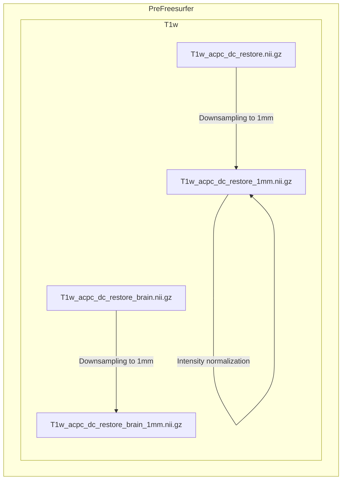
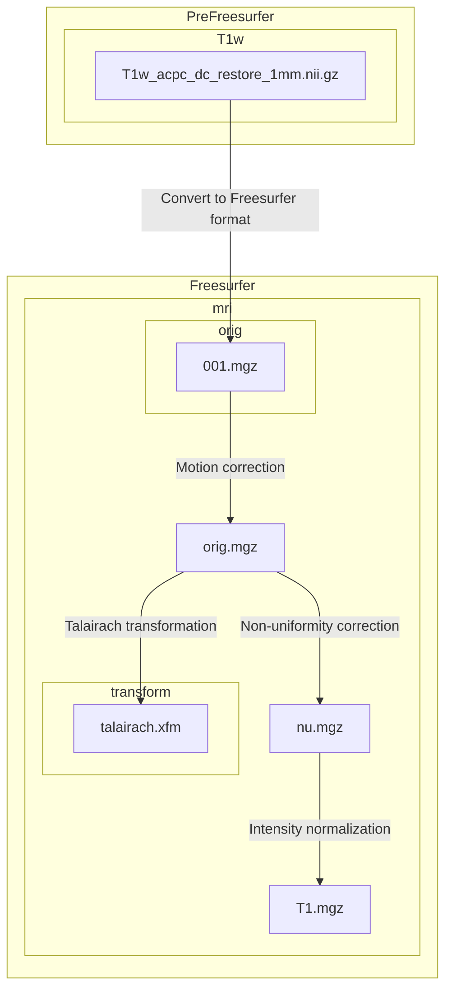
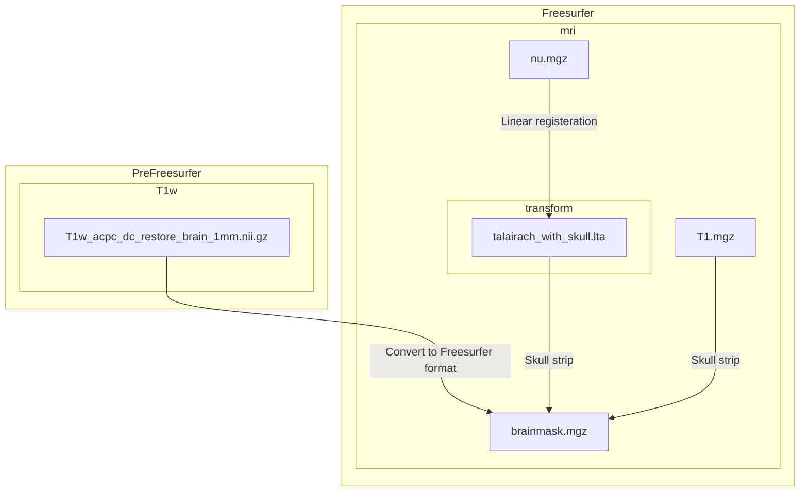

```mermaid
flowchart TD
    subgraph Freesurfer
        subgraph mri
	        brainmask.mgz
	        subgraph transform
		        talairach.lta
		        talairach.m3z
		        talairach_with_skull_2.lta
	        end
	        nu.mgz
	        nu.mgz ---> |Intensity normalization|norm.mgz
	        nu.mgz ---> |Remove neck|nu_noneck.mgz
	        norm.mgz ---> |Label subcortical structures|aseg.mgz
	        aseg.mgz ---> |Intensity normalization|brain.mgz
	        brain.mgz ---> |White matter segmentation|wm.mgz
	        wm.mgz ---> |Fill|filled.mgz 
	    end
	    subgraph surf
		    lh.orig.nofix ---> |Smoothing|lh.smoothwm
		    rh.orig.nofix ---> |Smoothing|rh.smoothwm
		    lh.smoothwm ---> |Inflation|lh.inflated.nofix
		    rh.smoothwm ---> |Inflation|rh.inflated.nofix
		    lh.inflated.nofix ---> |QSphere transformation|lh.qsphere.nofix
		    rh.inflated.nofix ---> |QSphere transformation|rh.qsphere.nofix
		    lh.qsphere.nofix ---> |Fix topology|lh.orig
		    rh.qsphere.nofix ---> |Fix topology|rh.orig
		    lh.orig ---> |Create final white surface|lh.white
		    lh.orig ---> |Create final pial surface|lh.pial
		    rh.orig ---> |Create final white surface|rh.white
		    rh.orig ---> |Create final pial surface|rh.pial
		    
	    end
    end
    nu.mgz ---> |Linear registration|talairach.lta
    brainmask.mgz ---> |Linear registration|talairach.lta
    norm.mgz ---> |Non-linear registration|talairach.m3z
    talairach.m3z ---> nu_noneck.mgz
    nu_noneck.mgz ---> |Linear registration|talairach_with_skull_2.lta
    talairach.lta ---> talairach_with_skull_2.lta
    filled.mgz ---> |Tessellate|lh.orig.nofix
	filled.mgz ---> |Tessellate|rh.orig.nofix
    filled.mgz ---> lh.white
	filled.mgz ---> lh.pial
	filled.mgz ---> rh.white
    filled.mgz ---> rh.pial
```

# Olfactory Dysfunction in Clinical High-Risk for Psychosis: Structural Connectivity
*Olfactory_Dysfunction_in_CHR* repository is developed by Jun Seo Hwang.
-   Jun Seo Hwang,  [junseo97@snu.ac.kr](mailto:junseo97@snu.ac.kr)

## Prerequisite
- FSL
- Freesurfer(ver 5.3.0)
- Pipeline-master
- workbench
- raw data directory

## Raw Data Structure

```
── working directory
   ├── subject_01
   │   ├── DTI_B1000
   │   │   ├── DTI_B1000.nii.gz
   │   │   ├── DTI_B1000.bval
   │   │   └── DTI_B1000.bvec
   │   ├── DTI_B2000
   │   │   ├── DTI_B2000.nii.gz
   │   │   ├── DTI_B2000.bval
   │   │   └── DTI_B2000.bvec
   │   ├── DTI_B3000
   │   │   ├── DTI_B3000.nii.gz
   │   │   ├── DTI_B3000.bval
   │   │   └── DTI_B3000.bvec
   │   ├── DTI_BLIP_LR
   │   │   ├── DTI_BLIP_LR.nii.gz
   │   │   ├── DTI_BLIP_LR.bval
   │   │   └── DTI_BLIP_LR.bvec
   │   ├── DTI_BLIP_RL
   │   │   ├── DTI_BLIP_RL.nii.gz
   │   │   ├── DTI_BLIP_RL.bval
   │   │   └── DTI_BLIP_RL.bvec 
   │   ├── T1
   │   │   └── T1.nii.gz 
   │   └── T2
   │       └── T2.nii.gz
   ├── subject_02
   │       :    
   ├── subject_n
   │
   ├── Pipelines-master
   │
   └── workbench
```


## PreFreesurfer


## Freesurfer
The main goals of this pipeline are to segment the volume into predefined structures (including the subcortical parcels used in CIFTI), reconstruct white and pial cortical surfaces, and perform FreeSurfer’s standard folding-based surface registration to their surface atlas (fsaverage).

### 1. Downsample to 1mm
The limitation with recon-all is that it cannot handle images of higher than 1 mm isotropic resolution or structural scans of greater than 256 × 256 × 256 voxels. The structural scans which exceed these limits must therefore be downsampled to 1 mm with spline interpolation before launching recon-all.

- Perform downsampling of the ACPC-aligned bias field corrected T1w image, **T1w_acpc_dc_restore.nii.gz**  to 1mm isotropic voxel size using `flirt` with spline interpolation. The output is saved as **T1w_acpc_dc_restore_1mm.nii.gz**.
- Apply a warp (spline interpolation) to the T1w image, **T1w_acpc_dc_restore.nii.gz**  and a warp (nearest-neighbor interpolation) to the T1w brain image **T1w_acpc_dc_restore_brain.nii.gz** to match the downsampled space. The output is saved as **T1w_acpc_dc_restore_1mm.nii.gz** and **T1w_acpc_dc_restore_brain_1mm.nii.gz**.
- Adjust the intensity of the downsampled T1w image by dividing the mean intensity, multiplying by 150 and taking the absolute value. The result is saved as **T1w_acpc_dc_restore_1mm.nii.gz**.

Terminal output:
```
Subject FREESURFER : Making Spline Interpolated Downsample to 1mm
```



### 2. 1st (out of 4) recon-all stage
In this step, FreeSurfer's autorecon1 pipeline is invoked, which includes process steps 1-5 of Autorecon Processing Stages.
1.  Motion Correction and Conform
2.  NU (Non-Uniform intensity normalization)
3.  Talairach transform computation
4.  Intensity Normalization 1
5. ~~Skull Strip~~

The skullstrip option is excluded due to reliability issues of poor FreeSurfer mri_em_register registrations with skull on.

- Convert downsampled T1w image in NIfTI format **T1w_acpc_dc_restore_1mm.nii.gz** to the FreeSurfer-specific MGZ format **001.mgz**.
- No motion correction is performed for **001.mgz** since there is only one image. Instead, **001.mgz** is copied to **orig.mgz**
	> No motion correction is done when there are multiple source volumes. This step will correct for small motions between them and then average them together.
	
- Perform Talairach transformation from **orig.mgz** to the MNI305 atlas using `talairach_avi`. The output affine transformation file is saved as **talairach.xfm**
- Perform non-uniform intensity correction on **orig.mgz** using `nu_correct`. Four iterations of nu_correct are run. The result is saved as **nu.mgz**
- Perform intensity normalization on **nu.mgz** using `mri_normalize`. The normalization is done to achieve a mean intensity of 110 in the white matter. The output is saved as **T1.mgz**.

Terminal output:
```
Subject FREESURFER : Running autorecon1 steps with the exception of -skullstrip
		.
		.
		.
#--------------------------------------------
#@# MotionCor
		.
		.
		.
#--------------------------------------------
#@# Talairach
		.
		.
		.
#--------------------------------------------
#@# Nu Intensity Correction
		.
		.
		.
#--------------------------------------------
#@# Intensity Normalization
		.
		.
		.
#------------------------------------------

Started at 
Ended   at 
#@#%# recon-all-run-time-hours 
recon-all -s Subject finished without error

```




### 3. Generate brain mask
HCP Phase II T1w data was not robustly registered using the linear registration within FreeSurfer that precedes FreeSurfer's brain extraction. To address this, the internal brain mask in FreeSurfer is generated aided using the initial brain mask generated in PreFreeSurfer before the registration. The brain mask is created by skull stripping and the removal of non-brain tissue from the T1 volume. The process involves utilizing the atlas (**RB_all_2008-03-26.gca**) to enhance surface correction ensuring more robust brain extraction.

- Convert downsampled T1w brain image in NIfTI format **T1w_acpc_dc_restore_brain_1mm.nii.gz** to the FreeSurfer-specific MGZ format **brainmask.mgz**.
- Register nu-corrected T1w image **nu.mgz** to automatic subcortical segmentation atlas using `mri_em_register`. The output transform is saved as **talairach_with_skull**.
- Strip skull of T1w image **T1.mgz** using `mri_watershed`. The atlas and transform obtained were used to correct the surface. The final brain mask output is overwritten as **brainmask.mgz**





### 4. 2nd (out of 4) recon-all stage
In this step, FreeSurfer's autorecon2 pipeline is invoked, which includes process steps 6-21 of Autorecon Processing Stages.

6. EM register (linear volumetric registration)
7. CA Intensity Normalization
8. CA Non-linear Volumetric Registration
9. Remove Neck
10. LTA with Skull
11. CA Label (Volumetric Labeling, ie Aseg) and Statistics
12. Intensity Normalization 2
13. White matter segmentation
14. Edit WM With ASeg
15. Fill
16. Tessellation
17. Smooth1
18. Inflate1
19.  QSphere
20. Automatic Topology Fixer
21. Final Surfs


- Perform linear registration of nu-corrected T1w image **nu.mgz** to automatic subcortical segmentation atlas using `mri_em_register`. **brainmask.mgz** obtained in the previous stage is used to guide the registration. The output transform is saved as **talairach.lta**.
- Perform intensity normalization based on the GCA (generic cortical atlas) model. The result is saved as **norm.mgz**.
- Perform non-linear registration of **norm.mgz** to the GCA atlas using `mri_ca_register`. The output transform is saved as **talairach.m3z**
- Remove neck region from **nu.mgz** with a radius of 25 mm. The result is saved as **nu_noneck.mgz**
- Perform linear registration of **nu_noneck.mgz** to GCA atlas that includes the skull. The initial transformation from the previous stage **talairach.lta** is used as a starting point. The output transform is saved as **talairach_with_skull_2.lta**.
- Label subcortical structures of **norm.mgz** based on the GCA model. The labeled output is saved as **aseg.mgz**
- Perform intensity normalization using only the brain as the input (so that it has to be done after the skull strip). The result is saved as **brain.mgz**.
- Perform white matter segmentation on **brain.mgz**. The output is saved as **wm.mgz**.
- Create the subcortical binarized volume from **wm.mgz** for generating the original surface. It involves cutting the midbrain from the cerebrum and the hemispheres from each other. The output is saved as **filled.mgz**.
- Create triangular mesh that represents the two-dimensional original surface of the interface between the white matter and grey matter from **filled.mgz** using `mri_tessellate`. The results are saved as **lh.orig.nofix** and **rh.orig.nofix**.
- Smoothing is applied to the surface mesh **lh.orig.nofix** and **rh.orig.nofix** using `mris_smooth`. The results are saved as **lh.smoothwm** and **rh.smoothwm** 
- Inflate the surface mesh **lh.smoothwm** and **rh.smoothwm** outward to `mris_inflate` create a more inflated representation while minimizing metric distortion to preserve distances and areas. The results are saved as **lh.inflated.nofix** and **rh.inflated.nofix**
- Perform a quasi-homeomorphic spherical transformation of the inflated surface **lh.inflated.nofix** to localize topological defects for subsequent topology fixing using`mris_sphere`. The results are saved as **lh.qsphere.nofix**
- Identify and remove topological defects such as holes in a filled hemisphere with **lh.qsphere.nofix** using `mris_fix_topology` .The results are saved as lh.orig
- Generate final surface files for cortical and white matter surfaces from **filled.mgz** and original surfaces **lh.orig** and  **rh.orig** using`mris_make_surfaces`. The cortical surfaces are saved as **lh.pial** and **rh.pial** and the white matter surfaces are saved as **lh.white** and **rh.white**.


Terminal output:
```
Subject FREESURFER : Running autorecon2 steps with few exceptions
		.
		.
		.
#-------------------------------------
#@# EM Registration
		.
		.
		.
#--------------------------------------
#@# CA Normalize
		.
		.
		.
#--------------------------------------
#@# CA Reg
		.
		.
		.
#--------------------------------------
#@# CA Reg Inv
		.
		.
		.
#--------------------------------------
#@# Remove Neck
		.
		.
		.
#--------------------------------------
#@# SkullLTA
		.
		.
		.
#-------------------------------------- 
#@# SubCort Seg
		.
		.
		.
#--------------------------------------
#@# Merge ASeg
		.
		.
		.
#--------------------------------------------
#@# Intensity Normalization2
		.
		.
		.
#--------------------------------------------
#@# Mask BFS
    	.
		.
		.
#--------------------------------------------
#@# WM Segmentation
    	.
		.
		.
#--------------------------------------------
#@# Fill
    	.
		.
		.
#--------------------------------------------
#@# Tessellate lh
    	.
		.
		.
#--------------------------------------------
#@# Smooth1 lh
    	.
		.
		.
#--------------------------------------------
#@# Inflation1 lh	
    	.
		.
		.
#--------------------------------------------
#@# QSphere lh		
    	.
		.
		.
#--------------------------------------------
#@# Fix Topology lh
	    .
		.
		.
#--------------------------------------------
#@# Make White Surf lh
	    .
		.
		.
#--------------------------------------------
#@# Tessellate rh
    	.
		.
		.
#--------------------------------------------
#@# Smooth1 rh
    	.
		.
		.
#--------------------------------------------
#@# Inflation1 rh	
    	.
		.
		.
#--------------------------------------------
#@# QSphere rh		
    	.
		.
		.
#--------------------------------------------
#@# Fix Topology rh
	    .
		.
		.
#--------------------------------------------
#@# Make White Surf rh
	    .
		.
		.		
Started at 
Ended   at 
#@#%# recon-all-run-time-hours 
recon-all -s Subject finished without error

```


### 3. Generate high-resolution white matter surface and refine T2w to T1w registration

In this step, high-resolution white matter surfaces are generated and the registration between T2w and T1w images is refined. The final white matter surfaces are created by registering surfaces generated from the downsampled 1mm T1w image to the full resolution of the original T1w image, ensuring a more precise representation of the white matter boundaries. Additionally, FreeSurfer's BBRegister algorithm refines T2w to T1w registration, leveraging higher-quality surfaces for improved accuracy over FLIRT's BBR implementation.


- Perform registration between downsampled 1mm T1w image **orig.mgz** with high-resolution original T1w image **T1w_hires.nii.gz** using `tkregister2`. The resulting matrix is saved as **hires21mm.dat**.
- Create high-resolution surfaces from original white matter surfaces **lh.white** and **rh.white** with matrix **hires21mm.dat** using `mri_surf2surf` . The outputs are saved as **lh.white.hires** and **rh.white.hires**.
- Create high-resolution volume from **wm.mgz**, **filled.mgz**, **brain.mgz**, and **aseg.mgz**. The outputs are saved as **wm.hires.mgz**, **filled.hires.mgz**, **brain.hires.mgz**, and **aseg.hires.mgz**
- Remove non-brain tissue from the high-resolution T1w image **T1w_hires.nii.gz** using `mri_mask`. The output is saved as **T1w_hires.masked.mgz**.
- Perform intensity normalization to **T1w_hires.masked.mgz** using the white surface information to ensure consistent intensity values across the brain. The output is saved as **T1w_hires.masked.norm.mgz**
- Deform the white matter surfaces based on the high-resolution inputs using `mris_make_surfaces`, improving their accuracy and alignment. The outputs are saved as **lh.white.deformed** and **rh.white.deformed**.

- Perform boundary-based registration between T2w image **T2w_acpc_dc_restore.nii.gz** with deformed white matter surface from T1w image **white.deformed** using FreeSurfer's `bbregister`. The resulting transformation matrix is saved as **T2wtoT1w.dat**.
- Refine the registration by applying the transformation matrix to align the T2w image with the T1w image **T1w_hires.nii.gz** using `tkregister2`. The resulting transformation matrix is saved as **T2wto T1w.mat**.
- Apply the transformation matrix to the T2w image. The output is saved as **T2w_hires.nii.gz**
- Create combined image of **T1w_hires.nii.gz** and **T2w_hires.nii.gz**. The output is saved as **T1wMulT2w_hires.nii.gz**

- Perform registration from high-resolution original T1w image **T1w_hires.nii.gz** back to downsampled 1mm T1w image **orig.mgz** using `tkregister2`. The resulting matrix is saved as **1mm2hires.dat**.
- Transform deformed surfaces back into the original FreeSurfer space (1mm space) to ensure compatibility with the rest of the FreeSurfer pipeline and further analysis. The outputs are saved as **lh.white** and **rh.white**
- Copy deformed outputs of **lh.curv.deformed** **lh.area.deformed** **lh.cortex.deformed.label** **rh.curv.deformed** **rh.area.deformed** **rh.cortex.deforemd.label** to their default FreeSurfer file names as **lh.curv** **lh.area** **lh.cortex.label** **rh.curv** **rh.area** **rh.cortex.label**.
